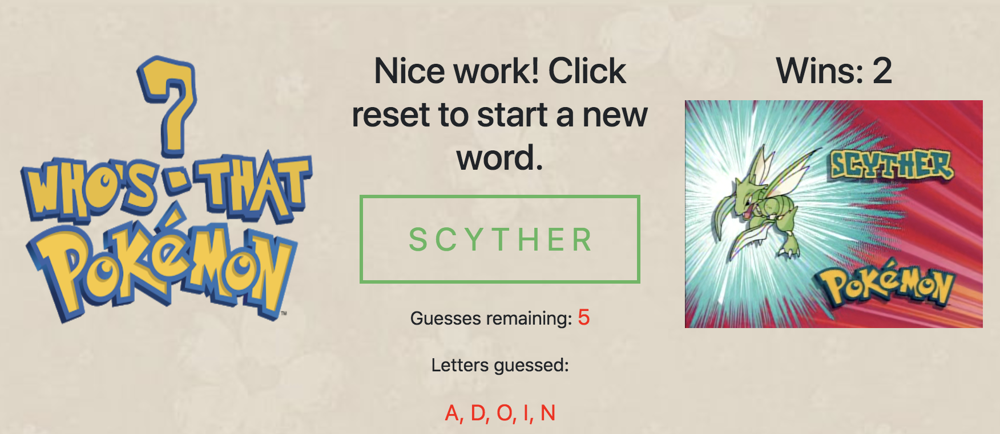

# Who's That Pokemon?

## Hangman-style word guess game

Guess the name of the pokemon before you run out of guesses!

This simple application was built with pure Javascript, with a dash of CSS for good measure. The `game.js` file randomly selects a pokemon name from an array and listens for key presses. It checks the key's value against an array of letters containing the alphabet to rule out numbers or special characters, then checks if it matches any letters for the current pokemon name. It accounts for any letters that appear more than once in the selected word, and doesn't decrement your guesses remaining for repeated letters. Once the name is guessed, an image matching the pokemon's name is displayed on the page, and the user is prompted to start on a new name.

